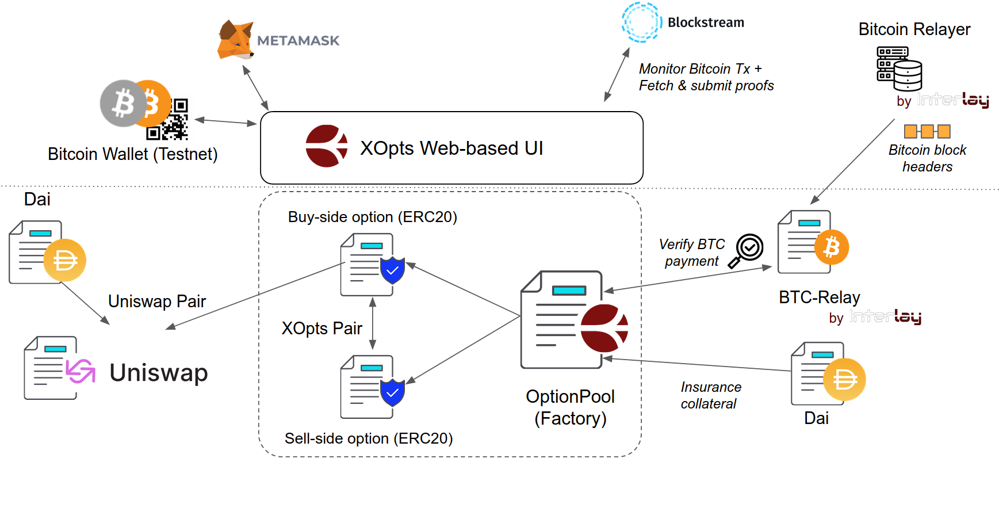
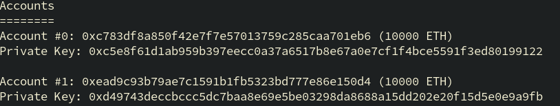

# XOPTS

<div align="center">
	<p align="center">
		
	</p>
	<p>
		<h3 align="center">XOPTS: Trustless, Non-Custodial Bitcoin Options on Ethereum</h3>
		<h4 align="center">Live at: <a href="https://xopts.io" target="__blank">xopts.io</a></h5>
		<h5 align="center">Status: Testnet (Ropsten) </h5>
	</p>
</div>


## About

In traditional finance, an [option](https://en.wikipedia.org/wiki/Option_(finance)) enables the owner to buy or sell an underlying asset at a specified conversion rate before an expiration date.
XOPTS extends the native capabilities of Ethereum to track and execute PUT Options against BTC. Specifically, we enable sellers to lock DAI collateral in a contract to mint ERC-20 compatible option
tokens that can be traded on [Uniswap](https://uniswap.org/). Buyers can then insure an arbitrary amount of BTC relative to the contract's strike price and pay in an amount of DAI collateral as premium.
Finally, options can be exercised once the buyer proves payment to the respective writers of that contract using an on-chain Bitcoin SPV client.

### Protocol

- A seller (writer) creates a BTC put option with a strike price (the value of BTC the seller is willing to insure in Dai), an expiry time (the validity of the option), and a premium (the fee paid to the seller for buying an option in Dai).
- A seller writes an option contract previously created by locking a number of Dai into the option contract. This creates a number of option tokens with the specific expiry, premium and strike price that are now available for buyers to obtain. During this process the seller also attaches his BTC address to the option tokens. For example, if the strike price is 10,000 Dai for a BTC and the seller locks 1,000 Dai, he would have generated 1,000 option tokens.
- The buyer then goes ahead and buys a number of option tokens at a specific expiry, premium, and strike price.
- During the expiry time, the buyer can exercise the option. To achieve this, he must send a number of BTC to the seller. Then, he proves that he sent the required number of BTC to the option smart contract. In return, the option tokens are burned and the buyer obtains underlying Dai provided by the seller.
- After the expiry time, the seller can reclaim any unused collateral.
- At any time a buyer can exchange his option tokens on Uniswap in a (Dai/Options) trading pair.


### System Overview

You can find more details on how XOpts works in our [Guides](https://xopts.io/help) (buy, sell, exercise, refund options).

<div align="center">
    
</div>

### Built with

* [Buidler](https://buidler.dev/)
* [Typescript](https://www.typescriptlang.org/)
* [Yarn](https://yarnpkg.com/)

## Getting Started

Make sure you have [node](https://nodejs.org/en/) installed. Generally, we also recommend managing different version of node via version manager like [NVM](https://github.com/nvm-sh/nvm).

Clone this repository and enter into its root folder.

```bash
git clone git@gitlab.com:interlay/xopts.git
cd xopts
```

Install the required node packages.

```bash
yarn install
```

### Try it out

Compile the contracts and create the [TypeChain](https://github.com/ethereum-ts/TypeChain) interfaces.

```bash
yarn build
```

Start buidlerevm.

```bash
yarn buidler
```

In another terminal, deploy the contracts and create some test data. Execute this from the root folder of the project.

```bash
yarn deploy::test --network localhost
```

> Note that you can deploy without specifying the network but this will not persist, hence we start an Ethereum node first.

Go to [xopts.io](https://xopts.io/) and point your [MetaMask wallet](https://metamask.io/) to `localhost:8545`. On your first setup, you might need to add one of the buidlerevm accounts to your MetaMask list of accounts by [importing the private key](https://metamask.zendesk.com/hc/en-us/articles/360015489331-Importing-an-Account). You can find the private keys of the buidlerevm accounts in the console output where you started buidler evm (with the `yarn buidler` command). It should look like this:

<div align="center">
    
</div>


## Development

After compiling the contracts as described above, run the tests.

```bash
yarn test
```

### Docker

Tests for both smart contracts and frontend can be executed within Docker.

```
docker build . -t interlay/xopts
docker run -t interlay/xopts yarn test
docker run -t interlay/xopts yarn test-js
```

### Docs

We build our docs using [solidity-docgen](https://github.com/OpenZeppelin/solidity-docgen) and [docsify](https://docsify.js.org/#/).

```bash
yarn docs
```

Point your local browser to `./docs/index.html` or use the `docsify-cli` tool to start a live reload development server.

```bash
yarn global add docsify-cli
docsify serve ./docs
```

### Releasing

Prior to bumping the `package.json` version, first clean and rebuild the project.

```bash
yarn clean
yarn build
yarn tsc
yarn publish --access public
```

### Bitcoin Testnet

In order to verify testnet transactions we need to swap out any mocked components.

1. Launch a local instance of Ganache via `yarn run ganache`.
2. Clone the [btc-relay-sol](https://gitlab.com/interlay/btc-relay-sol) repository.
3. Deploy using the testnet configuration.
4. On `OptionPool` deployment use the live relay address and `./lib/TxValidator.sol`.

### [React UI](https://gitlab.com/interlay/xopts-ui)

Clone the [xopts-ui](https://gitlab.com/interlay/xopts-ui) and in a separate terminal window.

```bash
git clone git@gitlab.com:interlay/xopts-ui.git
yarn install
yarn start
```

You can interact with a locally deployed front-end on [localhost:3000](http://localhost:3000).

## Deployments

### Gas Costs

| Function       	  | Gas     | Details				 	  |
|---------------------|---------|-----------------------------|
| `constructor`  	  | 4459604 | Deploy Option Factory	 	  |
| `createOption` 	  | 3099130 | Create Sell & Buy ERC-20    |
| `writeOption`  | 241516  | Deposit Collateral		  |
| `transfer` 		  | 119209  | Transfer Unsold Options     |
| `insureOption`	  | 221144  | Buy Options At Premium	  |
| `transfer` 		  | 117892  | Transfer Sold Options		  |
| `exerciseOption`    | 59380   | Prove BTC Payment			  |

### Ethereum Ropsten Testnet

+ Collateral (ERC20): [0xF6832c228552b551aA4Bf6A17Da9cf435D6cC524](https://ropsten.etherscan.io/address/0xF6832c228552b551aA4Bf6A17Da9cf435D6cC524)
+ OptionPool: [0x929bcF49ce947535815b3A34ac312D027ec06825](https://ropsten.etherscan.io/address/0x929bcF49ce947535815b3A34ac312D027ec06825)
+ Interlay's BTC-Relay: [0x78A389B693e0E3DE1849F34e70bf4Bcb57F0F2bb](https://ropsten.etherscan.io/address/0x78A389B693e0E3DE1849F34e70bf4Bcb57F0F2bb)

You can interact with Xopts on [xopts.io](https://xopts.io) or run a locally deployed front-end on [localhost:3000](http://localhost:3000).


## Roadmap

- [x] Put Options
- [ ] Call Options


## Contributing

If you would like to contribute, please file an issue on Github or reach out to us.

- [Telegram](t.me/interlay)
- [Riot](https://matrix.to/#/!nZablWWaicZyVTWyZk:matrix.org?via=matrix.org)

We are [hiring](https://www.interlay.io/careers/)!


## License

(C) Copyright 2020 [Interlay](https://www.interlay.io) Ltd

XOPTS is licensed under the terms of the Apache License (Version 2.0). See [LICENSE](LICENSE).

## Contact

Website: [Interlay.io](https://www.interlay.io)

Twitter: [@interlayHQ](https://twitter.com/InterlayHQ)

Email: contact@interlay.io
