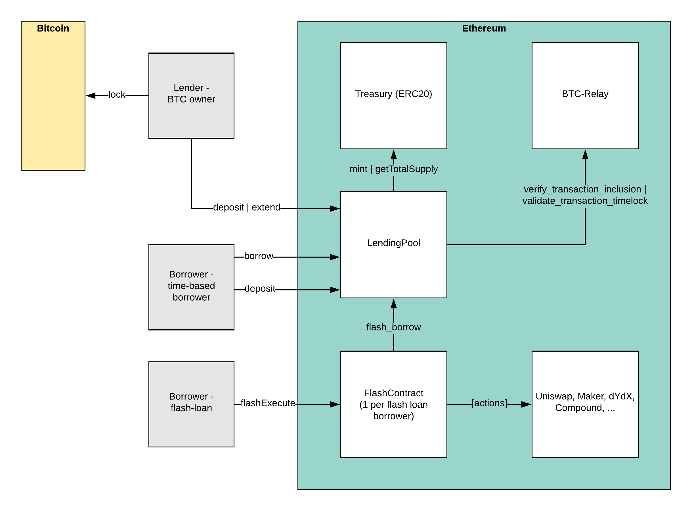

Architecture
============

XFlash has three different actors and four components.

Actors
------

The three different participants in XFlash are:

* **Lenders**: Lenders provide flashBTC by locking BTC on the Bitcoin blockchain in a time-locked transaction and prove correct locking to our XFlash smart contracts. For locking BTC, they can earn an interest on their BTC.
* **Borrowers**: Borrowers take either time-limited loans or flash loans against the BTC lending pool. Flash loans require borrowers to use their own smart contracts.
* **Relayers**: Intermediaries which run Bitcoin full nodes and monitor validity and availability of Bitcoin blocks submitted to BTC-Relay.

Components
----------

XFlash consists of the following components:

* **Front-end**: The front-end serves as a way to (1) lock Bitcoin into the XFlash lending pool and (2) borrow flashBTC either time-based or via flash loan contracts.
* **XFlash smart contracts**: The XFlash smart contracts enable the creation of Bitcoin-backed loans and control the size of the pool. They further act as the central connection for contracts that take a flash loan from the pool.
* **BTC-Relay smart contract**: The BTC Relay maintains the current longest Bitcoin chain and verifies the validity and inclusion of Bitcoin flash transactions.
* **Relayer**: The relayer is a service that submits new Bitcoin block headers to the BTC-Relay.

XFlash Smart Contracts
----------------------

There are in total three dedicated flash loan smart contracts.

* **Treasury**: The :ref:`treasury` smart contract is a modified ERC20 contract. It allows expiring token balances for individual accounts. A minted ``flashBTC`` token has a "time-to-live" after which it is automatically burned.

* **Lending Pool**: The :ref:`pool-sc` smart contract is the main access point lenders prove they have locked BTC and for borrowers to take out loans. The pool supports two types of lending.
  
  1) Time-based lending: ``flashBTC`` tokens that expire after a pre-determined time.
  2) Flash loans: ``flashBTC`` tokens that can be used within a single transaction only.

* **XFlash**: The :ref:`xflash-sc` is the basic contract to execute flash loans against the lending pool. Since flash loans need to be executed within a single transaction, a borrower needs to pre-define actions within his or her own contract. The XFlash contract serves as a simple starting point.

Overview
--------

