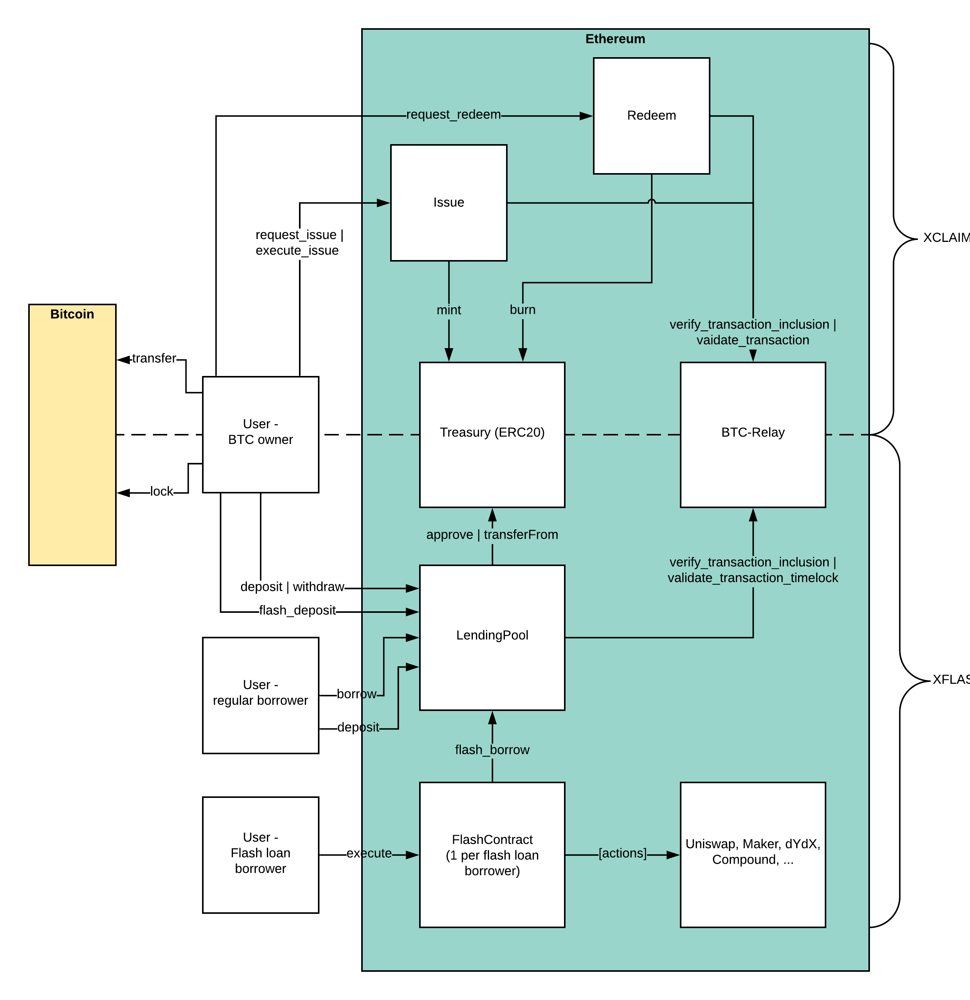

Architecture
============

XFLASH has three different actors and four components.

Actors
------

The three different participants in XFLASH are:

* **BTC providers**: BTC providers lock BTC on the Bitcoin blockchain in a time-locked transaction and prove correct locking to our XFLASH smart contracts. For locking BTC, they can earn an interest on their BTC.
* **Users**: Users take flash loans against the BTC lending pool using their own smart contracts.
* **Relayers**: Intermediaries which run Bitcoin full nodes and monitor validity and availability of Bitcoin blocks submitted to BTC-Relay.

Components
----------

XFLASH consists of the following components:

* **XFLASH smart contracts**: The XFLASH smart contracts enable the creation of Bitcoin-backed flash loans and control the size of the pool. They further act as the central connection for contracts that take a flash loan from the pool.
* **BTC-Relay smart contract**: The BTC Relay maintains the current longest Bitcoin chain and verifies the validity and inclusion of Bitcoin flash transactions.
* **Relayer**: The relayer is a service that submits new Bitcoin block headers to the BTC-Relay.
* **Front-end**: The front-end serves as a way to (1) lock Bitcoin into the XFLASh lending pool and (2) create flash loan contracts.

XFLASH Smart Contracts
----------------------

There are in total three dedicated flash loan smart contracts.

