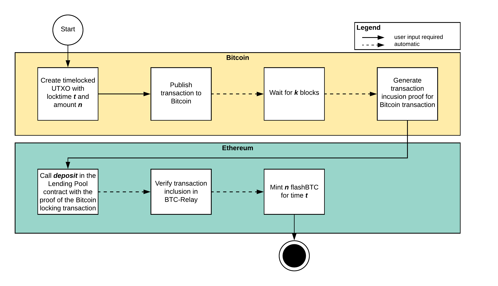
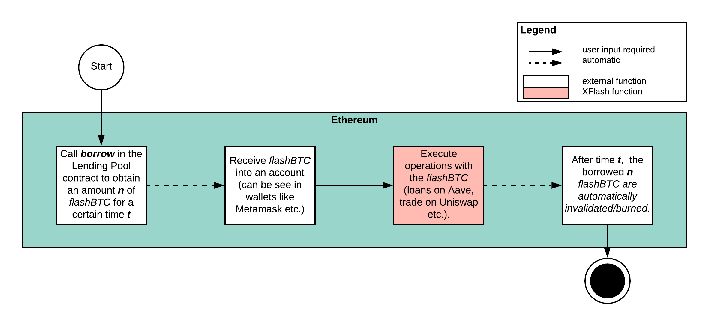
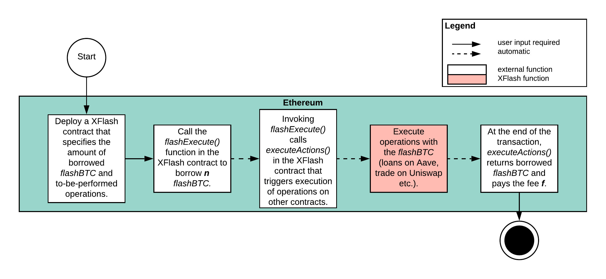

User Flows
==========

XFlash has three main user interactions.

1. Lenders provide BTC in the form of ``flashBTC`` into the :ref:`pool-sc`.
2. Borrowers take out time-limited ``flashBTC`` tokens against the available tokens in the :ref:`pool-sc`.
3. Flash borrowers take out flash-loans within a single transaction against the :ref:`pool-sc` leveraging their own :ref:`xflash-sc`.

Below we depict and describe the user flows.

Lenders
-------

Lenders are using the :ref:`mint-protocol` protocol to generate ``flashBTC``. Their basic user flow consists of the following seven steps. For further details on Bitcoin transaction requirements and the Ethereum function, please refer to the protocol definitions and the specification.

1. The lender prepares a time-locked BTC transaction with a time-limit :math:`t` and an amount :math:`n` that he wants to issue as ``flashBTC``.
2. The lender publishes the transaction to Bitcoin.
3. The lender waits for *k* blocks that its transaction is confirmed.
4. The lender generates a transaction inclusion proof for its Bitcoin transaction.
5. On Ethereum, the lender calls :ref:`deposit` in the :ref:`pool-sc` to create ``flashBTC``.
6. The :ref:`pool-sc` automatically verifies the correctness of the transaction.
7. The :ref:`pool-sc` automatically mints ``flashBTC`` to the lender. The lender is then able to see the issued ``flashBTC`` in a wallet of his choice given the wallet integrates with the :ref:`treasury` ERC20 contract.

Borrower (Regular)
------------------

Borrowers take out a loan of ``flashBTC`` for a predefined time :math:`t`. They only have to perform one step manually, whereas the expiry of the loan is automatic.

1. The borrower calls the :ref:`borrow` function in the :ref:`pool-sc` to obtain an amount :math:`n` ``flashBTC`` for a time :math:`t`.
2. The borrower then automatically receives ``flashBTC`` into his account.
3. (Optional): the borrower can then execute operations in other protocols.
4. After time :math:`t` the borrowers loan automatically expires.

    

Flash Borrower
--------------

The flash borrower only takes out a ``flashBTC`` loan in a single transaction. To enable this, the flash borrower needs to deploy a smart contract that executes all operations he desires first. The full details are given in the :ref:`flashloan-protocol` protocol.

1. The borrower deploys an :ref:`xflash-sc` smart contract.
2. The borrower calls the :ref:`flash-execute` function in the smart contract to take a loan of :math:`n` ``flashBTC`` in a single transaction against the :ref:`pool-sc`.
3. The :ref:`pool-sc` automatically calls the :ref:`execute-actions` function in the borrower's :ref:`xflash-sc` giving it the requested amount of ``flashBTC``.
4. The :ref:`xflash-sc` executes the operations specified by the borrower (e.g. trading on Uniswap, updating a CDP on Maker).
5. At the end of the function call of :ref:`execute-actions`, the :ref:`xflash-sc` contract repays the loan and needs to provide the required fee to the :ref:`pool-sc` contract.

